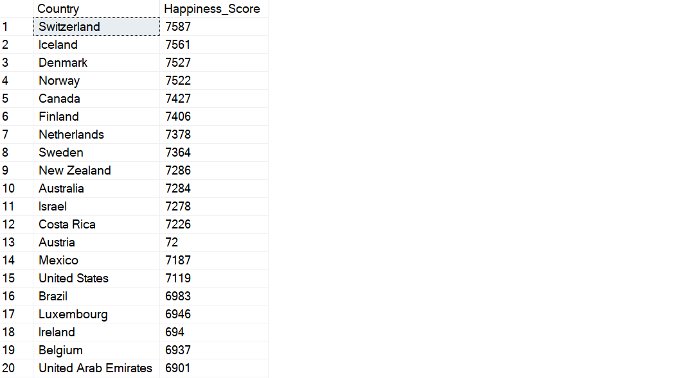
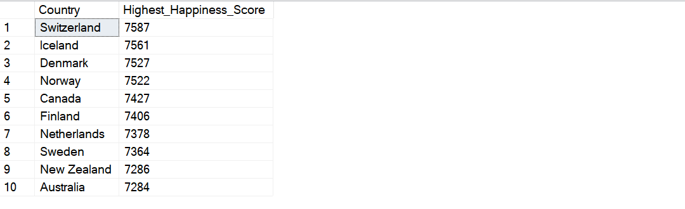
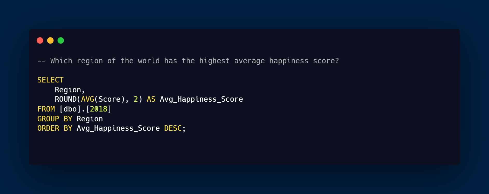
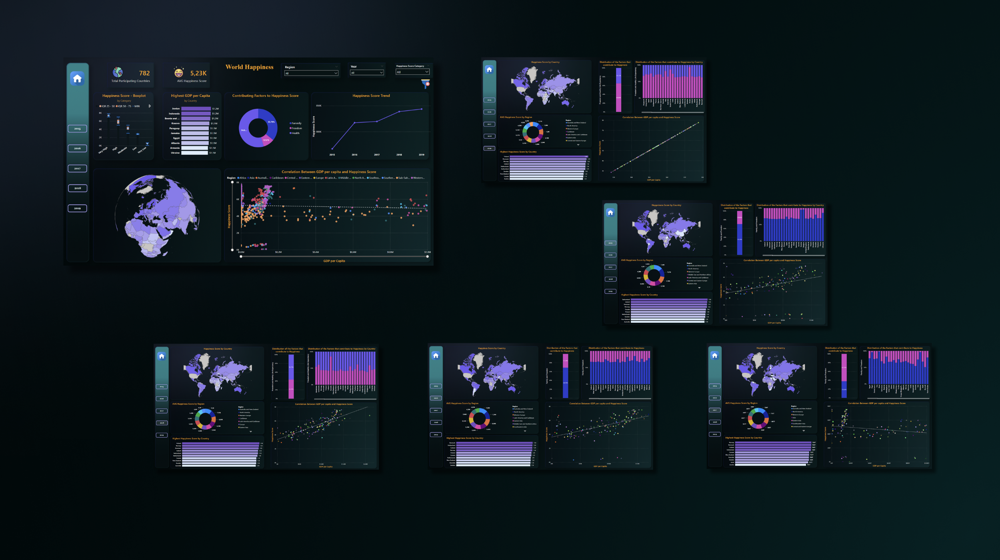

# World Happiness Analyze

## Introduction

This project aims to analyze and visualize the World Happiness Report data to gain insight into the factors influencing global happiness scores from 2015 to 2019.

## Problem Statement

Explore and understand the patterns, trends, and contributing factors to happiness scores worldwide. Answer specific questions regarding regional variations, key factors, and changes over time.

## Skill Demonstrated

- SQL database management
- Data querying and transformation
- Power BI for data visualization
- Dashboard creation
- Data analysis and interpretation

## Data Sourcing

The project utilizes datasets from the World Happiness Report obtained from Hackernoon. The datasets are divided into multiple years, with each year representing a separate dataset. The primary focus is on the following datasets:

- World Happiness Report 2015
- World Happiness Report 2016
- World Happiness Report 2017
- World Happiness Report 2018
- World Happiness Report 2019

These datasets provide comprehensive information on various factors contributing to happiness scores across different countries for the specified years.

_Additional Information: In the dataset there is data based on the original suervey (said on the website), namely in 2017, and in making the dashboard later it will be simplified to facilitate analysis._

## Data Transformation

Data was transformed using SQL queries to merge, clean, and organize datasets from different years into a unified format suitable for analysis. Additionally, calculations were performed to derive relevant metrics.

### Data Transformation using SQL ( Include Missing Value, Update, and Add New Column )

#### Update & Missing Value

- 2017 Table

As said on the website, here is a little picture of the value in the 2017 table.)

- 2018 Table

- 2019 Table

#### Add New Column

- Add Year Column

#### Aggregation in SQL

- 2015 Table

| SQL Queries | Result |
|----------|----------|
|  |  |
|  |  |
|  |  |
|  |  |
|  |  |

- 2016 Table

| SQL Queries | Result |
|----------|----------|
|  |  |
|  |  |
|  |  |
|  |  |
|  |  |

- 2017 Table (As said on the website, here are the values in the 2017 table.)

| SQL Queries | Result |
|----------|----------|
|  |  |
|  |  |
|  |  |
|  |  |
|  |  |

- 2018 Table

| SQL Queries | Result |
|----------|----------|
|  |  |
|  |  |
|  |  |
|  |  |
|  |  |

- 2019

| SQL Queries | Result |
|----------|----------|
|  |  |
|  |  |
|  |  |
|  |  |
|  |  |

#### SQL Queries to combine all tables as data that will be used to create Dashboards.

| SQL Queries | Result |
|----------|----------|
|  |  |

#### Import Dataset to Power BI 

### DAX Measure & Create New Column ( Power BI )

- Measure

- Create New Column

| DAX | Result |
|----------|----------|
|  |  |

## Modeling

While the project does not involve complex modeling, certain SQL queries involve aggregations and calculations to provide meaningful insights.

## Analyze & Visualization

The analysis includes answering specific questions such as :
- What is the distribution of the happiness scores for each country?
- Which country has the highest happiness score?
- What is the correlation between GDP per capita and happiness score?
- What is the distribution of the factors that contribute to happiness?
- Which region of the world has the highest average happiness score?

In this project there are 6 pages :
- Home ( Overview )
- 2015
- 2016
- 2017
- 2018
- 2019

You can interact with report here _[Novypro](https://www.novypro.com/project/world-happiness)_

## Conclusion & Recommendation

The analysis reveals insights into global happiness trends. Some of these are :

- Total number of countries participating in the survey: 782 (from 2015 to 2019)
- There is a trend of increasing happiness scores over time.
- Average Happiness Score: Average happiness score across all countries: 5.2K (from 2015 to 2019)
- Factors Influencing Happiness Score:
  - Health contributes approximately 54.6%
  - Family contributes around 35.7%
  - Freedom contributes about 9.5% to the happiness score (from 2015 to 2019)
- Top Regions: Western Europe, Australia, and North America consistently hold top positions from 2015 to 2019.
- The scatter plot shows a positive correlation between GDP per capita and happiness score, indicating that higher GDP per capita is associated with higher happiness scores.
- Countries such as Switzerland, Denmark, Iceland, and Norway always occupy the top positions with Happiness Scores reaching more than 7k from 2015 to 2019.

Conclusions drawn from the data are summarized, and recommendations for further exploration or actions are provided.
